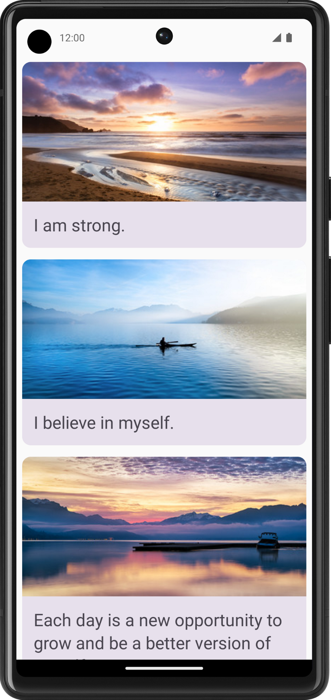

# Affirmations App

- In this codelab, you learn how to make a scrollable list in your app using Jetpack Compose.

- You will be working with the Affirmations app, which displays a list of affirmations paired with beautiful images to bring positivity to your day!

- The data is already there, all you need to do is take that data and display it in the UI.

## Prerequisites

1. Familiarity with Lists in Kotlin
2. Experience building layouts with Jetpack Compose
3. Experience running apps on a device or emulator

## What you'll learn

1. How to create a material design card using Jetpack Compose
2. How to create a scrollable list using Jetpack Compose

## What you'll build

- You will take an existing application and add a scrollable list to the UI
- The finished product will look like this:

  

## Progress tracked on my github page

<a href="https://github.com/georgesroberto/Learn/tree/Affirm" >https://github.com/georgesroberto/Learn/tree/Affirm</a>
