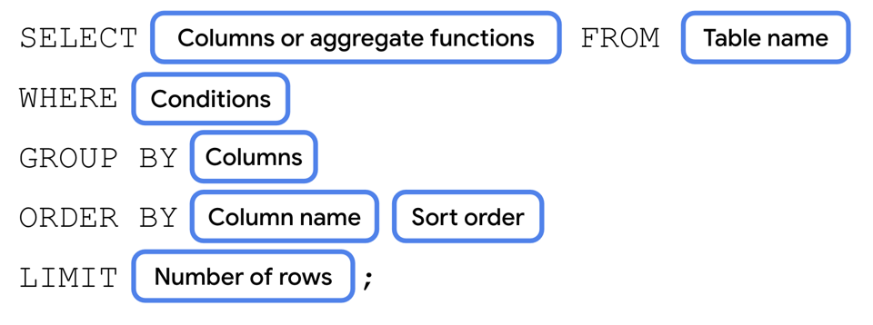

# SQL

**Congratulations!**

You learned a lot! You can now **read** from a database using

> SELECT statements, including:

```sql
WHERE, GROUP BY, ORDER BY, and LIMIT clauses to filter results.
```

You also learned about frequently used aggregate functions, the **`DISTINCT`** keyword to specify unique results, and the **`LIKE`** keyword to perform a text search on the values in a column.

Finally, you learned how to

```sql
INSERT, UPDATE, and DELETE
```

rows in a data table.

SELECT statement syntax:



## Learn More

While we've focused on the basics of SQL and some common use cases for Android development, there's a lot more that SQL can do. Refer to the following resources as an additional reference for what you've learned or to learn even more about the topic.

1. Database Inspector
2. Save data using SQLite
3. Aggregate functions
4. SQL Quick reference
5. Creating data tables
6. SQL Joins
7. SQLite Performance
